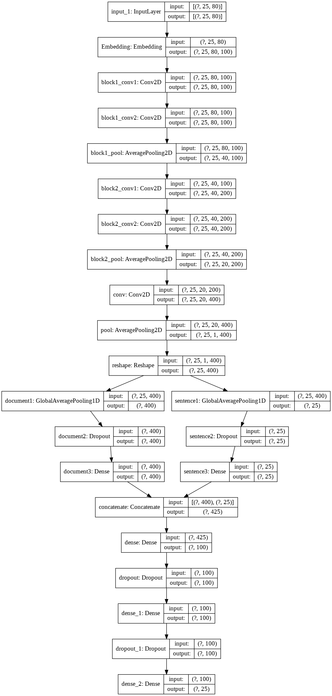

# Extractive Text Summarization using CNNs
Project about NLP, use architecture convolutional neural network to summarize a paragraph.

Overview on notebook at [here](notebooks/Extractive_Paragraph_Summarization.ipynb).

## DATA
CNN/DaliyMail: 
download [here](https://drive.google.com/drive/folders/1O9NyQjMZC3D5Cr4OzB6NdrLQpHSgGZD4?usp=sharing)

## Dependencies
- python==3.7.9
- jupyter==1.0.0
- numpy==1.19.2
- pandas==1.1.3
- tqdm==4.54.0
- tensorflow==2.1.0


**Use conda:**
```
git clone https://github.com/huanhkv/Extractive-Paragraph-Summarization.git
cd Extractive-Paragraph-Summarization
conda env create -f env.yml
conda activate nlp_ats
```

## Commands

1. **Clean data**
	- input_path: folder path contain input file (`full.txt` and `summ.txt`)
	- output_path: folder path contain output file (`processed_full.txt` and `processed_summ.txt`)
	- maxlen_sentence: this is a number integer
	- maxlen_word: this is a number integer
	```
	python3 src/data/make_dataset.py \
		--input_path data/raw/CNNDM_data/train_mini \
		--output_path data/processed/train_mini \
		--maxlen_sentence 25 \
		--maxlen_word 80

	python3 src/data/make_dataset.py \
		--input_path data/raw/CNNDM_data/valid \
		--output_path data/processed/valid \
		--maxlen_sentence 25 \
		--maxlen_word 80
	```

2. **Tokenizer data**
	- input_path: folder path contain processed data (2 file: `processed_full.txt` and `processed_summ.txt`)
	- output_path: folder path contain tokenized data (2 file: `x.npy` and `y.npy`)
	- save_tokenizer: file path save tokenizer (json file)
	```
	python3 src/features/convert_data.py \
		--input_path data/processed/valid \
		--output_path data/interim/valid \
		--save_tokenizer models/tokenizer.json

	python3 src/features/convert_data.py \
		--input_path data/processed/valid \
		--output_path data/interim/valid \
	```
	
3. **Create and train model**
	- train_folder: folder path contain tokenized training data (2 file: `x.npy` and `y.npy`)
	- valid_folder: folder path contain tokenized validation data (2 file: `x.npy` and `y.npy`)
	- epochs: This is an integer number
	- path_tokenizer: file path of tokenizer saved
	- filepath_embedding: file path pre-trained embedding ([download pre-trained](#model))
	- output_model: file path to save model (file .h5)
	```	
	python3 src/models/train_model.py \
		--train_folder data/interim \
		--valid_folder data/interim \
		--epochs 1 \
		--path_tokenizer models/tokenizer.json \
		--filepath_embedding models/glove.6B.100d.txt \
		--output_model models/model_save.h5 
	```

4. **Predict**
	- input_path: file path contain content to predict
	- tokenizer_path: file path of tokenizer saved
	- model_path: file path of model use to predict
	```
	python3 src/models/predict_model.py \
		--input_path data/raw/demo_predict.txt \
		--tokenizer_path models/tokenizer.json \
		--model_path models/model_trained.h5
	```

## Model
This model with inputs is a paragraph that has multi-sentence. The maximum sentences for inputs is 25 and the limit for words is 80 for each sentence.

- **Input shape**: (None, 25, 80)

- **Pre-trained word vectors:** we use pre-trained word vectors [Global Vectors for Word Representation](https://nlp.stanford.edu/projects/glove/) of Stanford with GloVe.6B.100d.txt. Quick download [here](https://drive.google.com/file/d/1MkaPqIFhrYVUot_x_8ks26GxxZxj4Gls/view?usp=sharing)

[](models/plot_model.png)

---

## Member
- Hồ Khả Việt Huấn - 43.01.104.058
- Nguyễn Văn Thịnh - 43.01.104.168
- Lâm Phước Đạt - 43.01.104.015